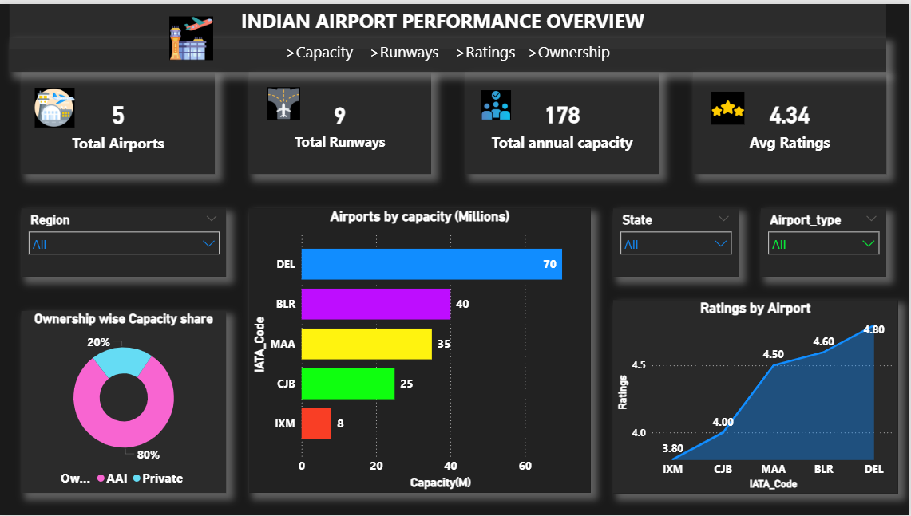
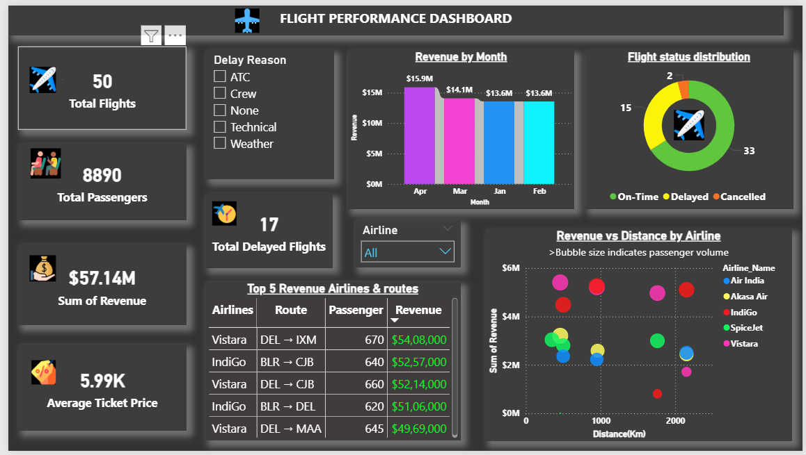

# Airport & Flight Performance Analysis

## Project Overview
This project analyzes airport and flight performance using Power BI, with datasets created and managed in CSV format.  
The dashboards provide insights into airport capacity, runway availability, flight operations, passenger volume, delays, and revenue performance.

The objective of this project is to showcase strong Power BI skills such as data modeling, DAX calculations, and interactive dashboard creation using flat file data sources.

---

## Tools & Technologies
- *Power BI* – Data modeling, DAX measures, and dashboard visualization  
- *CSV Files* – Data creation and preparation (Airport, Flight, Date tables)

---

## Data Sources
All data used in this project was *manually created in CSV format*:
- Airport table  
- Flight table  
- Date table  

These CSV files were imported and modeled inside Power BI using proper relationships.

---

## Dashboards Overview

### 1️⃣ Airport Performance Dashboard
- Total airports
- Total runways
- Airport capacity analysis
- Ownership-wise capacity distribution
- Airport ratings overview

### 2️⃣ Flight Performance Dashboard
- Total flights
- Total passengers
- Total revenue
- Average ticket price
- Flight status distribution (On-time, Delayed, Cancelled)
- Delay reason analysis
- Revenue by airline and route

---

## Key Insights
- Airports with higher capacity do not always handle the highest passenger volume
- Certain routes generate higher revenue despite fewer passengers
- Operational and weather-related issues contribute significantly to delays
- A small number of airlines account for a major share of total revenue

---

## Project Highlights
- End-to-end Power BI project
- CSV-based data source (no SQL / Python)
- Clean data model with Airport, Flight, and Date tables
- Effective use of DAX measures
- Professional dashboard design and storytelling

---

## Dashboard Preview

### Airport Performance Dashboard

### Flight Performance Dashboard

---

## Author
*Arun*  
Aspiring Data Analyst
